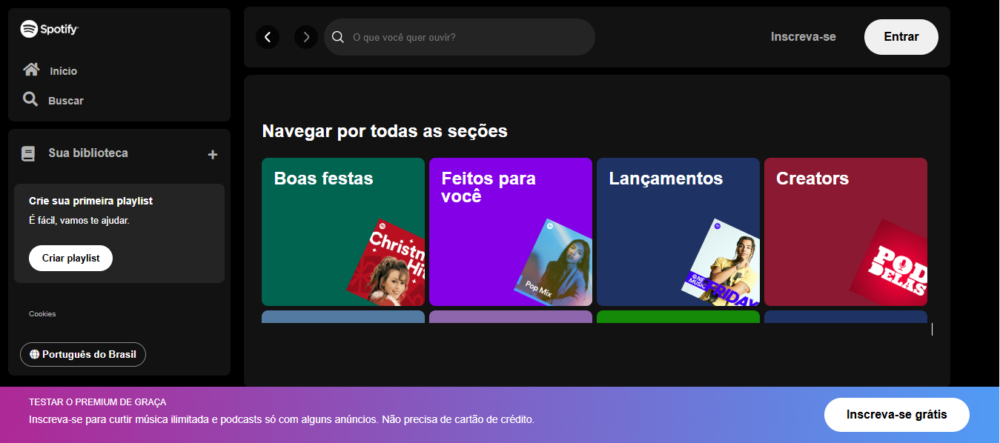

# spotify


  
  
:wave:[Projeto completo] ()

## 🚀 Tecnologias

Esse projeto foi desenvolvido com as seguintes tecnologias:

- HTML
- CSS
- JS
## 
Essa é uma página responsiva, para usar em diversos tipos de micro, pequena e média empresas. Contém as seguintes seções: header, section, Home,Contato e Footer
Feito com ♥ por min :wave: [Conecte se ao linkedin!](https://www.linkedin.com/in/ana-carolina-front-end/)

